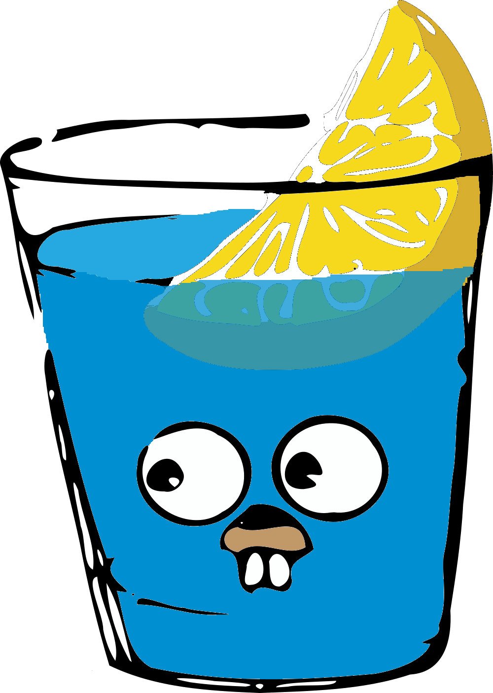
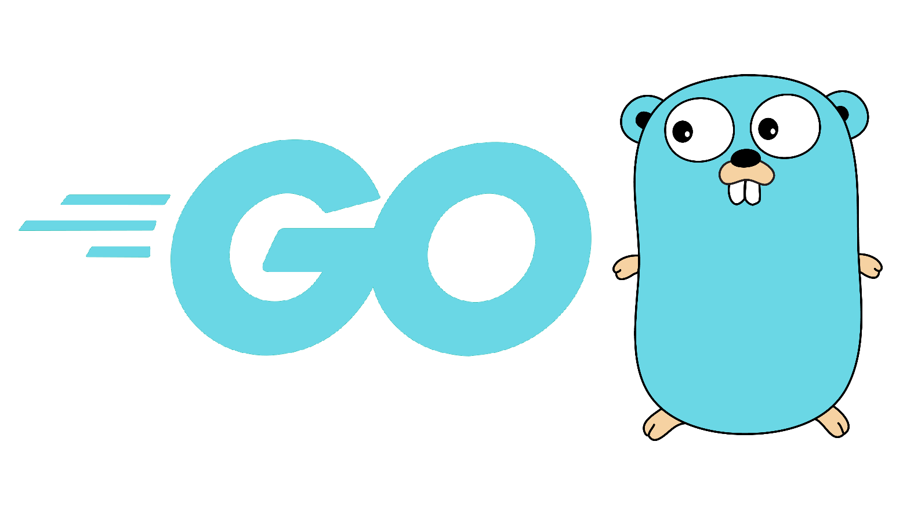

# UserService

#### This is a user service of my backend project written in golang

### Used libraires
- Gin 
- logrus

### Used tech:
- Kafka 
- Redis
- Postgres
- MinIO
- Docker

### This service is responsible for:
- Searching users
- User profile settings
- Moderation (Ban/Unban)
- Setting roles
- Deleting profile

